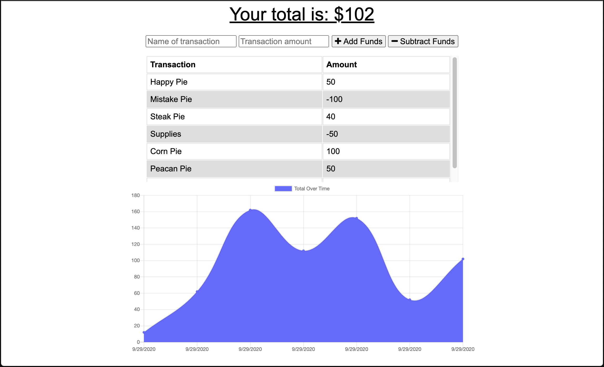

# Budget Tracker - Progressive Web App

Technologies: Express, Mongo Database, Moongoose Schema, Progressive Web App (PWA)

The Budget Tracker App is a progressive web application that helps users keep track their budget wether if they are online or offline.

## View Application:

* [Heroku Link: https://jenn-budget-tracker-pwa.herokuapp.com/](https://jenn-budget-tracker-pwa.herokuapp.com/)

## Functionality
Functionality for sending expenses and deposits to the database while offline, is accomplished through storing user transaction activity into the IndexedDB database that's built into the browser.

After user is back online, our application checks the offline storage of items and then sends it back to the online server so that the information is persistent and up-to-date.

* Offline Functionality:
  * Enter deposits
  * Enter expenses

* When Brought Back Online:
  * Offline entries should be added to database.

## Business Context
This application gives users a fast and easy way to track their money and allows them to access that information anytime wether traveling, online or offline.
